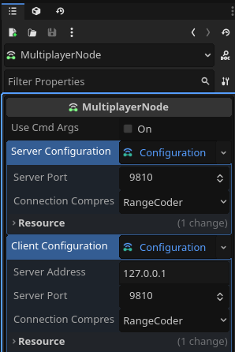
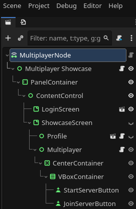
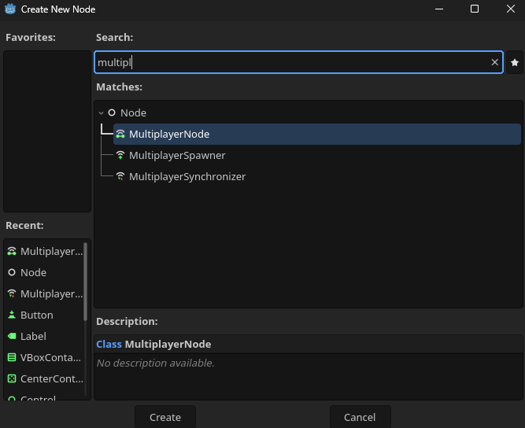

# **Multinet** *(Godot 4 Multiplayer C# addon)*

Multinet is an add-on for Godot 4, which aims to provide easier access and setup for Godot's built-in multiplayer implementation. The package provides centralized management for the Godot multiplayer server and client.

The manager could be accessed from anywhere in the code and is used to configure the server and the client, manage multiplayer connections & lifecycle events, automatically track peer connection/disconnection, etc.

> [!WARNING]
> - This addon is not yet feature complete.
>   - Missing features:
>       - Client Interpolation & Extrapolation for synchronized variables
>       - Server-side lag compensation for synchronized variables
>   - This addon is developed and used actively for my own game. I try to keep things abstract always, but there could be occasions where I could make the implementation work as it suits my game specifically. This said I do not rule out suggestions for improvement or changes, but would rather not support custom implementations.

## **Table of Contents**

- [**Multinet** *(Godot 4 Multiplayer C# addon)*](#multinet-godot-4-multiplayer-c-addon)
  - [**Table of Contents**](#table-of-contents)
  - [**Server and Client Configuration**](#server-and-client-configuration)
  - [**GameServer**](#gameserver)
  - [**GameClient**](#gameclient)
  - [**MultinetManager**](#multinetmanager)
    - [***Methods***](#methods)
    - [***Properties***](#properties)
    - [***Signals***](#signals)
  - [**MultiplayerNode**](#multiplayernode)

## **Server and Client Configuration**

Two custom resource types are registered by the addon for the server configuration (`ServerConfiguration`) and the client configuration (`ClientConfiguration`).

Both configurations are initialized with default values as child resources of the `MultiplayerNode`. They could be edited in the **Inspector** panel in **Godot**.

> [!TIP]
> Server and client configurations could be saved as any other Godot resource in the project. For example one could have a debug and production configuration and load them depending on cmd line args.

## **GameServer**

The `GameServer` class is a wrapper around the `ENetMultiplayerPeer` from Godot, but exposes only server-side functionality. The server instance is used to apply the `ServerConfiguration` and Start/Stop the server.

This class is intended to be used 'as is' in most cases and it is automatically managed by the `MultinetManager` class. In case there is a need for extension of this class one could do so, by inheriting the `GameServer` class, which is a `GodotObject` in the end.

> [!NOTE]
> In case you inherited and extended the server you will also need to change the protected field `Server` in the `MultinetManager` class and adapt your changes.

## **GameClient**

The `GameClient` class is a wrapper around the `ENetMultiplayerPeer` from Godot, but exposes only client-side functionality. The client instance is used to apply the `ClientConfiguration` and Connect/Disconnect to the server.

This class is intended to be used 'as is' in most cases and it is automatically managed by the `MultinetManager` class. In case there is a need for extension of this class one could do so, by inheriting the `GameClient` class, which is a `GodotObject` in the end.

> [!NOTE]
> In case you inherited and extended the client you will also need to change the protected field `Client` in the `MultinetManager` class and adapt your changes.

## **MultinetManager**

This class manages both the server and the client, depending on which side the script is running. It is an autoload script that is added by activating the addon. In order to access it from the code by calling `MultinetManager.Instance`.

The manager exposes the following:

### ***Methods***

- **SetServerConfiguration**
  - Overrides the server configuration
- **SetClientConfiguration**
  - Overrides the client configuration
- **StartServer**
  - Starts the Godot multiplayer server
- **StopServer**
  - Stops the running Godot multiplayer server
- **JoinServer**
  - Starts the Godot multiplayer client and connects to the server
  - Returns the Godot multiplayer peer ID
- **LeaveServer**
  - Disconnects the Godot multiplayer client from to the server.
- **AddSpawnedPlayer**
  - Adds a spawned player to the collection of spawned players
  - Requires a peer ID and a spawned node by the server
  - Notifies all peers
- **RemoveSpawnedPlayer**
  - Removes a spawned player to the collection of spawned players
  - Requires a peer ID
  - Notifies all peers

### ***Properties***

- **PeerId**
  - The Godot Multiplayer API peer ID
- **IsServer**
  - Indicated if the current instance is running as server
- **ServerTime**
  - For the server instance this is the real time passed since game started on the server.
  - For the client instance this is the last reported server time.
- **ClientTime**
  - For the server instance this does not matter
  - For the client instance this is the real time passed since game started on the client.
- **ConnectedPlayer**
  - A readonly list of all connected peers to the server.
  - The list is automatically managed by the `MultinetManager`
- **SpawnedPlayers**
  - A readonly dictionary of all spawned players in the multiplayer scene.
  - This collection is manually maintained
    - To add a spawned player: `MultinetManager.Instance.AddSpawnedPlayer(peerId, spawnedPlayerNode)`
    - To remove a spawned player: `MultinetManager.Instance.RemoveSpawnedPlayer(peerId)`

### ***Signals***

- **ServerStarted**
  - Signal emitted when the server starts successfully
  - *Executed on:* **Server**
- **ServerStopped**
  - Signal emitted when the server is manually stopped
  - *Executed on:* **Server**
- **ServerStartFailed**
  - Signal emitted when the server fails to start
  - *Executed on:* **Server**
- **JoinedServer**
  - Signal emitted when the client establishes a successful connection to the server
  - *Executed on:* **Client**
- **LeftServer**
  - Signal emitted when the client leaves the server connection manually
  - *Executed on:* **Client**
- **JoinServerFailed**
  - Signal emitted when the client fails to establish a connection to the server
  - *Executed on:* **Client**
- **ConnectionToServerFailed**
  - Signal emitted when the active connection to the server fails
  - *Executed on:* **Client**
- **ClientConnected**
  - Signal emitted when a new client establishes a successful connection to the server
  - *Executed on:* **Server & All other client**
- **ClientDisconnected**
  - Signal emitted when a client disconnects from the server
  - *Executed on:* **Server & All other client**
- **PlayerSpawned**
  - Signal emitted when a player is added to the `SpawnedPlayers` collection
  - *Executed on:* **Server & All other client**
- **PlayerDespawned**
  - Signal emitted when a player is removed from the `SpawnedPlayers` collection
  - *Executed on:* **Server & All other client**

## **MultiplayerNode**

The `MultiplayerNode` is designed to be set as root for any multiplayer scene where a server and a client should be setup and connected. This node manager configuration for both the client and the server. It also starts the server in case the game instance is started with the `dedicated_server` feature of the engine.

`MultiplayerNode` is registered as a node type from the addon so it could be found in the default node creation window.

> [!NOTE]
> By using this node as a root to multiplayer scenes we ensure that the server and the client would have the exact same tree structure, which is crucial for making things work with Godot's multiplayer.
